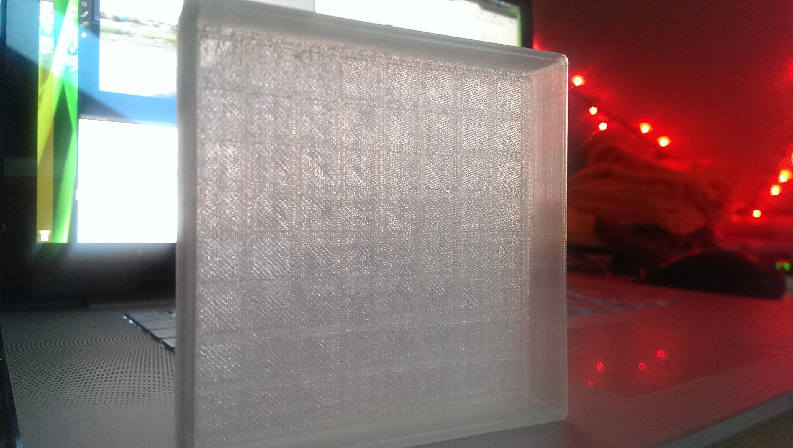
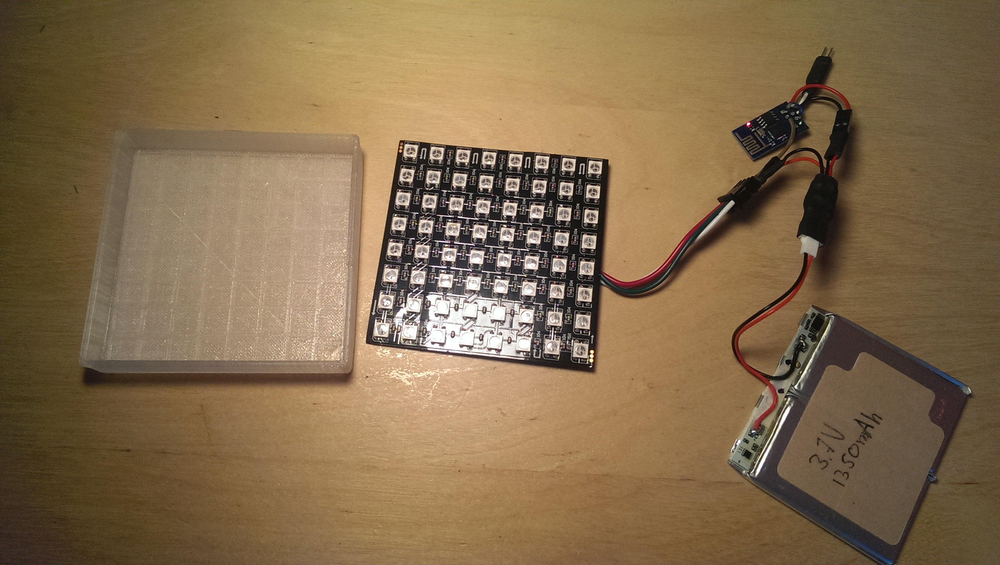
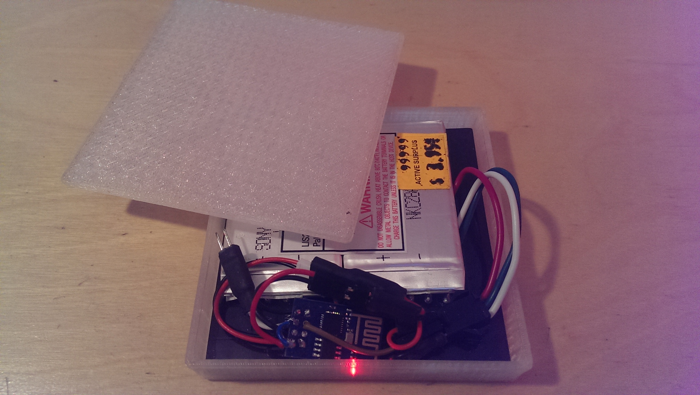

Title: WS2812 LED Matrix
Date: 2015-10-12 16:51
Category: ESP8266
Tags: ESP8266, ESP, WS2812, WS2812B, 3D Printing, CAD

The LED Matrix is constructed out of a WS2812B 8x8 panel, a 3D printed case, an ESP8266, a LiPo battery and some software.

## Code

    git clone https://github.com/robertfoss/led_matrix.git

The software is divided into two parts. The receiving end is run on the ESP8266 that has been flashed with [NodeMCU](https://github.com/nodemcu/nodemcu-firmware) and is a simple lua script that receives UDP packets and forwards them to the excellent WS2812 module created by the the equally excellent [Konrad Beckmann](https://github.com/kbeckmann).

The second part is run on a host pc. It's a simple python script that generates a framebuffer from a sinusoidal animation and transmits it over UDP to the IP of the ESP8266.
This relies on the host pc being able to connect to the ESP8266. Ideally they're on the same LAN to minimise UDP packets being lost or delayed, which causes the animation to lag or skip.
This part was also written by [Konrad Beckmann](https://github.com/kbeckmann) as part of a larger fancier animation, but repurposed here to be used as a proof of concept.

## 3D Model

The 3D model was created using google sketchup. The case is a made out of 2 parts. A front and a lid. The front has grooves that fit the WS2812 LEDs and make sure that the matrix is firmly stuck in place but also make sure that the light from the LEDs is diffused the proper amount.

## Bill of materials

 * 18$ [WS2812B 8x8 Matrix](http://www.aliexpress.com/item/8x8-64-LED-Matrix-WS2812-LED-5050-RGB-for-Arduino-FZ1104/32373601634.html?ws_ab_test=201407_4,201444_5,201409_4)
 * 2$ [ESP8266 ESP-01](http://www.aliexpress.com/item/Free-shipping-ESP8266-serial-WIFI-wireless-module-wireless-transceiver/32341788594.html?ws_ab_test=201407_4,201444_5,201409_4)
 * 1$ [AMS1117-3.3 Voltage regulator](http://www.aliexpress.com/item/DC-5V-to-3-3V-Step-Down-Power-Supply-Module-AMS1117-3-3-LDO-800MA/32357910447.html?ws_ab_test=201407_4,201444_5,201409_4)
 * 4$ [LiPo 3.7V 300mAh](http://www.aliexpress.com/item/Eachine-3D-X4-RC-Quadcopter-Spare-Parts-3-7V-300Mah-Battery/32335487012.html?ws_ab_test=201407_4,201444_5,201409_4) - A higher capacity battery is better as long as it fits inside of the case.
 * $3 [LiPo USB Charger](http://www.aliexpress.com/item/F14786-4-in-1-3-7V-Lipo-Battery-Charger-USB-Interface-4-Ports-For-Hubsan-X4/32394891091.html?ws_ab_test=201407_4,201444_5,201409_4)
 * $6 [Battery connector cable](http://www.aliexpress.com/item/10-pairs-of-battery-plug-connector-1S-2-Pins-Mirco-model-battery-connector/32305697134.html) - Only a few will be needed.
 
A thing to be aware of is the fact that all orders from AliExpress will take at least 30 days to arrive to your door. Sometimes more. 

## Hardware construction

You'll have to excuse the lack of a proper schematic, but this has been a fairly organic project.

The connectors of for the battery (B_VCC and B_GND), the WS2812 matrix (LED_VCC, LED_GND and LED_DATA), the ESP8266 (ESP_3V3, ESP_CH_PD, ESP_GND, ESP_GPIO2) and the AMS1117-3.3V (LDO_VCC, LDO_GND and LDO_3V3)

 * B_VCC + LED_VCC + LDO_VCC
 * B_GND + LED_GND + LDO_GND + ESP_GND
 * LDO_3V3 + ESP_3V3 + ESP_CH_PD
 * LED_DATA + ESP_GPIO2
 
 
## Issues and TODOs

 * The AMS1117-3.3 is not ideal. The voltage drop is too high. Ideally it should be replaced with a Step-UP/DOWN converter. When the battery is running low the ESP8266 is the first part to fail. It does so while there is quite a lot of power left in the LiPo.
 * This setup does not work at all without a WiFi or a host computer feeding it animations. Nothing is preventing is from working without a connection, but the connection is one of the most interesting aspects of the project.
