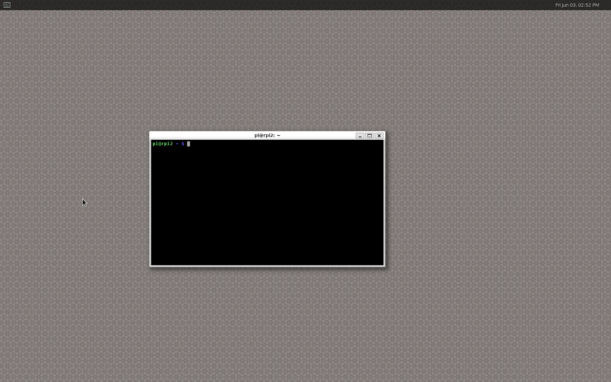

Title: Running Weston on a Raspbian
Date: 2016-06-03 10:32
Category: wayland
Tags: wayland, weston, rpi, rpi2, kernel

Progress in the VC4 graphics camp and the Wayland camp now enables us to run
Weston on top of the drm backend for VC4 platforms. Previously software acceleration
using pixman was needed, but this is no longer the case.

Additionally the rpi backend for weston is now being removed since it has been
obsoleted by the improved drm layer.

Let's explore running hardware accelerated Weston on the Raspberry Pi.

## Building Linux kernel

A comprehensive guide for building a recent Linux kernel for Raspberry Pi boards has
been written by the Raspberry Pi foundation and is available [here](https://www.raspberrypi.org/documentation/linux/kernel/building.md).

As of this writing the guide helps you build a v4.4 kernel which is good enough for our purposes.

## Set up alternative install location

These build instructions are based on the [Wayland instructions](https://wayland.freedesktop.org/building.html)
from freedesktop.org, but altered to target VC4 and Raspbian.

You probably don't want to install experimental builds of software among the usual
software of your operating system, so let's define a prefix for where to install
our builds.

    # Change WLD to any location you like
    export WLD=~/local
    export LD_LIBRARY_PATH=$WLD/lib
    export PKG_CONFIG_PATH=$WLD/lib/pkgconfig/:$WLD/share/pkgconfig/
    export PATH=$WLD/bin:$PATH
    export ACLOCAL_PATH=$WLD/share/aclocal
    export ACLOCAL="aclocal -I $ACLOCAL_PATH"

    # Needed by autotools
    mkdir -p $WLD/share/aclocal

## Installing dependencies

Start by installing the build dependencies of mesa, weston and wayland.

    # Enable source packages
    sudo sed -e "s/#\sdeb-src/deb-src/g" -i /etc/apt/sources.list
    sudo apt update

The above step can alternatively be completed using the GUI of your
package manager, by enabling source packages.

    # Install build dependencies of mesa
    sudo apt-get build-dep mesa

    # Install build dependencies of wayland/weston
    sudo apt-get install \
      libevdev libevdev-dev \
      libwacom libwacom-dev \
      libxkbcommon libxkbcommon-dev

## Building Mesa

Configure and compile mesa with vc4, wayland and EGL support.

    git clone git://anongit.freedesktop.org/mesa/mesa
    cd mesa
    ./autogen.sh --prefix=$WLD \
      --enable-gles2 \
      --with-egl-platforms=x11,wayland,drm \
      --enable-gbm --enable-shared-glapi \
      --with-gallium-drivers=vc4 \
      --without-dri-drivers \
      --disable-va \
      --disable-vdpau \
      --disable-xvmc \
      --disable-omx
    make -j4 && make install

## Building Weston and dependencies

Weston and Wayland have a number of dependencies that also need to be fetched
and built.

#### Wayland
Weston is a Wayland compositor, so we're going to have to build Wayland.

    git clone git://anongit.freedesktop.org/wayland/wayland
    cd wayland
    ./autogen.sh --prefix=$WLD
    make -j4 && make install
    cd ..

    git clone git://anongit.freedesktop.org/wayland/wayland-protocols
    cd wayland-protocols
    ./autogen.sh --prefix=$WLD
    make install
    cd ..

#### libinput
libinput is a dependency of Wesron, handles input devices like keyboards, touchpads and mice.

    git clone git://anongit.freedesktop.org/wayland/libinput
    cd libinput
    ./autogen.sh --prefix=$WLD
    make -j4 && make install
    cd ..

#### Weston
Finally we've built all of the dependencies of Weston and can now build it.

    git clone git://anongit.freedesktop.org/wayland/weston
    cd weston
    ./autogen.sh --prefix=$WLD \
      --disable-libunwind
    make -j4 &&
    sudo make install
    cd ..

## Running Weston
That wasn't so bad, it took a little while, but now we're ready to start Weston.
Now, let's fire up a (virtual) terminal. Make sure that you're not running an
X terminal, ssh terminal or serial terminal.

Running weston in this way depends on logind.

    # Make sure that $DISPLAY is unset.
    unset DISPLAY

    # And that $XDG_RUNTIME_DIR has been set and created.
    if test -z "${XDG_RUNTIME_DIR}"; then
      export XDG_RUNTIME_DIR=/tmp/${UID}-runtime-dir
      if ! test -d "${XDG_RUNTIME_DIR}"; then
        mkdir "${XDG_RUNTIME_DIR}"
        chmod 0700 "${XDG_RUNTIME_DIR}"1
      fi
    fi

    # Run weston:
    weston

## Try weston applications
Now that we're running weston, let's try some applications.
They're located in the top level directory of weston.

 * weston-terminal
 * weston-flower
 * weston-gears
 * weston-smoke
 * weston-image
 * weston-view
 * weston-resizor
 * weston-eventdemo

When you've started all of your favorite applications you can grab a screenshot 
by pressing **Super + s**, which will save wayland-screenshot.png in your home
directory.

