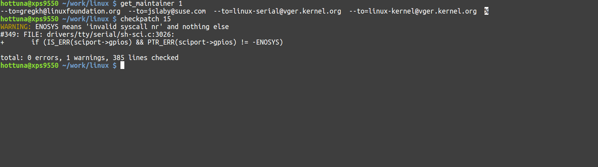

Title: Linux kernel development shell scripts
Date: 2016-07-26 10:32
Category: kernel
Tags: linux, kernel, script, collabora

While upstreaming kernel patches scripts/checkpatch.pl and scripts/get_maintainer.pl
often come in handy.
But to me the interface they provide is slightly bulky and rely
on using patch files instead of git commits, which to me is a bit inconvenient.

These scripts are all meant to be included in **.bashrc** or **.zshrc**

## scripts/checkpatch.pl helper

    #!/bin/bash
    function checkpatch {
      if [ -z ${1+x} ]; then
        exec git diff | scripts/checkpatch.pl --no-signoff -q -
      elif [[ $1 == *"cache"* ]]; then
        exec git diff --cached | scripts/checkpatch.pl --no-signoff -q -
      else
        NUM_COMMITS=$1
        exec git diff HEAD~$NUM_COMMITS..HEAD | scripts/checkpatch.pl --no-signoff -q -
      fi
    }

The checkpatch script simple wraps the patch creation process and allows you to
right away specify which 

#### Example

    ~/work/linux $ checkpatch 15
    WARNING: ENOSYS means 'invalid syscall nr' and nothing else
    #349: FILE: drivers/tty/serial/sh-sci.c:3026:
    +	if (IS_ERR(sciport->gpios) && PTR_ERR(sciport->gpios) != -ENOSYS)
    
    total: 0 errors, 1 warnings, 385 lines checked

In this example the 15 last commits are checked against scripts/checkpatch.pl
for correctness.

## scripts/get_maintainer.pl helper

    #!/bin/bash
    function get_maintainer {
      NUM_COMMITS=$1
    
      MAINTAINERS=$(git format-patch HEAD~$NUM_COMMITS..HEAD --stdout | scripts/get_maintainer.pl)
    
      # Remove extraneous stats
      MAINTAINERS=$(echo "$MAINTAINERS" | sed 's/(.*//g')
    
      # Remove names from email addresses
      MAINTAINERS=$(echo "$MAINTAINERS" | sed 's/.*<//g')
    
      # Remove left over character
      MAINTAINERS=$(echo "$MAINTAINERS" | sed 's/>//g')
    
      echo "$MAINTAINERS" | while read email; do
        echo -n "--to=${email}  ";
      done
    }

#### Example

    ~/work/linux $ get_maintainer 1
    --to=gregkh@linuxfoundation.org  --to=jslaby@suse.com  --to=linux-serial@vger.kernel.org  --to=linux-kernel@vger.kernel.org
    
    ~/work/linux $ git send-email -1 $(get_maintainer 1)

