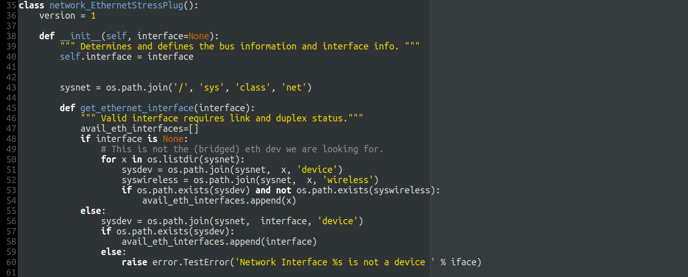

Title: Ethernet device stress testing
Date: 2016-08-25 13:05
Category: kernel
Tags: linux, kernel, script, collabora, chromiumos

During testing of power management patches for usb ethernet dongles, a script
was needed to stress test connecting/disconnecting/reconnecting these devices.

Luckily a script like that already exists as a part of the chromiumos project,
and can be found [here](https://chromium.googlesource.com/chromiumos/third_party/autotest/+/HEAD/client/site_tests/network_EthernetStressPlug/network_EthernetStressPlug.py).

That script does however not run standalone and requires a remote device
(chromebook) to execute on. So I took the liberty of changing it to support
local testing. The modified version can be found [here](files/2016-08-25_network_EthernetStressPlug.py).

This might come in handy for someone, if not, the script will at least be
archived on this site.

## Example
    $ sudo pip2.7 install autotest
    $ ip link
    1: lo: <LOOPBACK,UP,LOWER_UP> mtu 65536 qdisc noqueue state UNKNOWN mode DEFAULT group default qlen 1
        link/loopback 00:00:00:00:00:00 brd 00:00:00:00:00:00
    2: wlp2s0: <BROADCAST,MULTICAST,UP,LOWER_UP> mtu 1500 qdisc pfifo_fast state UP mode DORMANT group default qlen 1000
        link/ether 48:e2:44:f6:e8:5b brd ff:ff:ff:ff:ff:ff
    27: enx000ec689ab9e: <NO-CARRIER,BROADCAST,MULTICAST,UP> mtu 1500 qdisc pfifo_fast state DOWN mode DEFAULT group default qlen 1000
        link/ether 00:0e:c6:89:ab:9e brd ff:ff:ff:ff:ff:ff
    $ export INTERFACE=enx000ec689ab9e
    $ export NUM_ITERATIONS=10
    $ sudo python network_EthernetStressPlug.py $INTERFACE $NUM_ITERATIONS
    
