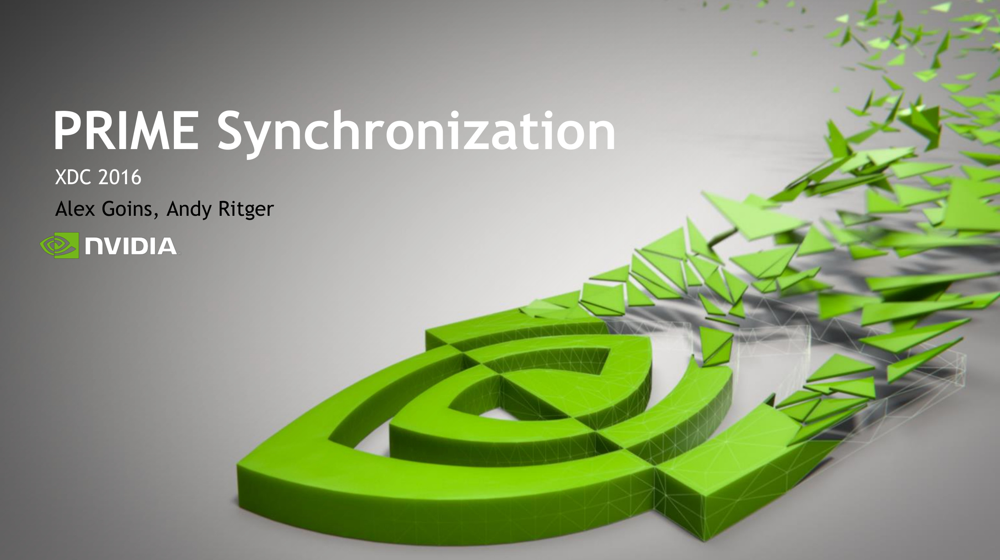

Title: XDC 2016
Date: 2016-09-23 20:20
Category: linux
Tags: linux, graphics, kernel, collabora

XDC 2016 was hosted in Helsinki at Haaga-Helia.
The full [program](https://www.x.org/wiki/Events/XDC2016/Program/) was filmed and is archived [here](https://www.youtube.com/channel/UCXlH5v1PkEhjzLFTUTm_U7g/videos).

## [[Slides](files/2016-09-23/xdc-2016-fast_ui_draw.pdf)] FastUIDraw - High Performance 2D renderer for GPUs
Kevin Rogovin gave an excellent talk about FastUIDraw, which is a highly optimiser 2d renderer for GPUs.

By agressively targetting GPUs only and limiting the feature set to what is required by a browser FastUIDraw performs >9.3x faster than Cairo-CPU and >4.8x times the previous GPU state of the art SKIA-GL.

Hopefully FastUIDraw can be incorporated into upstream of ChromiumOS and Android.

## [[Slides](files/2016-09-23/xdc-2016_2d_perf.pdf)] 2D Performance
[Martin Perez](http://phd.mupuf.org/) gave a talk about 2D performance and power consumption of the Xserver.

The xf86-video-intel driver showed quite mixed performance numbers of 1.51-32.6x times the CPU performance.
The FPS/Watt measurements showed 0.73-15.1x times the CPU efficiency.

When looking at Cairo traces the power efficiency is actually lower using GPU accelaration than with CPU acceleration.
This is somewhat expected in that the Cairo workload is not very high throughput, so the overhead of doing 2D operations is relatively high compared to the actual work.

Overall toolkits are moving away from letting the Xserver do 2D rendering, for reasons of portability and performance.

## [[Slides](files/2016-09-23/xdc-2016-glvnd-status.pdf)] libglvnd Status Update
Andy Ritger gave a talk about the current libglvnd status.
The goal of libglvnd is to allow different graphics libraries from potentially different vendors to coexist on a filesystem and in a process.
GLX/EGl/OpenGL/OpenGLES/GL are all supported by libglvnd.

Currently mesa supports libglvnd for OpenGL and GLX, with EGL support being in the pipeline.

## [[Slides](files/2016-09-23/xdc-2016-drm_hwcomposer.pdf)] drm_hwcomposer
Sean Paul and Zach Reizner gave an exceptionally well timed talk about the Android && Chromium drm_hwcomposer project.
drm_hwcomposer is an implementation of the hwcomposer (HWC) API ontop of the Linux DRM/KMS.

The talk detailed the implications of HWC2 and explicit fencing.
A large part of the HWC1 implementation can be removed from drm_hwcomposer since it's made redundant by the fencing support in HWC2.
So, for example the worker threads (DrmCompositorWorker and FrameWorker) are no longer necessary and can be removed.

## [[Slides](files/2016-09-23/xdc-2016-nouveau_update.pdf)] Status update of Nouveau
[Samuel Pitoiset](https://hakzsam.wordpress.com/), Karol Herbst, [Pierre Moreau](https://twitter.com/kurtelborgpm) and [Martin Perez](http://phd.mupuf.org/) gave a talk about what has happened in Nouveau land the last year.

Hardware support is as always taking steps forward, with Fermi support is scheduled for Linux v4.9+.

A call to arms for Nouveau compiler optimizations was issued by [Martin Perez](mailto:martin.peres AT free DOT fr).
There is a lot of low hanging fruit for optimizations is available, and the compiler is overall in a good shape.
So feel free to contact Martin or the Nouveau project if you are interested or curious.

As of the Maxwell generation of GPUs the firmware needed now has to be signed, GM20x/GP100 firmware has been released, but support for loading firmware on Tegra has not been provided by NVidia.

Martin made a rather clear point of needing to see some cooperation from NVidia in order for the Nouveau project to be able to make progress with new and upcoming NVidia hardware.

## Conclusion
Thanks to the X.Org Foundation and the board of directores for arranging XDC 2016.
This post has been a part of work undertaken by my employer [Collabora](http://www.collabora.com).
