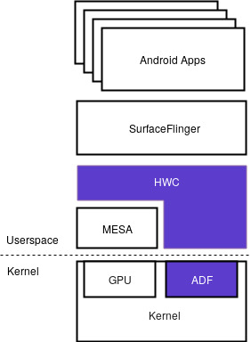

Title: Android: Enabling mainline graphics
Date: 2017-03-28 15:18
Category: aosp
Tags: android, aosp, graphics, drm, drm_hwcomposer, hwcomposer, HWC2, collabora
Description: Android uses the HWC API to communicate with graphics hardware. This API is not supported on the mainline Linux graphics stack, but by using drm_hwcomposer as a shim it now is.

The  [HWC](https://source.android.com/devices/graphics/implement-hwc.html) 
(Hardware Composer) API is used by SurfaceFlinger for compositing layers to the screen.
The HWC abstracts objects such as overlays and 2D blitters and helps offload some work
that would normally be done with OpenGL.
SurfaceFlinger on the other hand accepts buffers from multiple sources, composites them,
and sends them to the display.

The above graphic depicts the traditional Android graphics stack is built ontop of the
proprietary drivers of a GPU vendor, that expose the HWC API which SurfaceFlinger uses
to talk to the hardware.

This is where drm_hwcomposer comes into play. Since the mainline kernel graphics stack
doesn't offer the HWC API, drm_hwcomposer is introduced to interface with the mainline
graphics stack through mesa and libdrm. Before this work drm_hwcomposer only offered the
HWC1 API.
Since Android 7.0 version 2 of the HWC API is used by SurfaceFlinger. HWC2 differs in a few
ways from the previous version, for example the semantics of fence support were changed and
the GPU can now be used as a fallback when compositing layers.

Up until recently the mainline kernel lacked the fence primitive offered by Android
used in HWC1 and HWC2. But after Gustavo Padovans work on 
[adding fence support](http://padovan.org/blog/2016/09/mainline-explicit-fencing-part-1/)
to the mainline kernel was upstreamed in
[v4.10](http://padovan.org/blog/2017/02/collabora-contributions-to-linux-kernel-4-10/),
 the mainline kernel now has fence support equivalent to that of Android.

The new fence support enabled work on drm_hwcomposer to add HWC2 support.
And with it we are now able to boot Android on the db410c running the freedreno driver.
But in theory it should work on any mainline kernel graphics stack enabled GPU.

Currently the work is being upstreamed to the
[ChromiumOS repo](https://chromium.googlesource.com/chromiumos/drm_hwcomposer/)
which is the official upstream for drm_hwcomposer.

A number of projects have seen contributions to in order to enable this work:

  * kernel - sync_file, in-fence and out-fence support added.
  * libdrm - fence support added.
  * mesa - support for passing fences added.
  * intel-gpu-tools - sync and fence tests added.
  * drm_hwcomposer - HWC2 and fence support added.

## Thanks
This post has been a part of work undertaken by my employer [Collabora](http://www.collabora.com).
