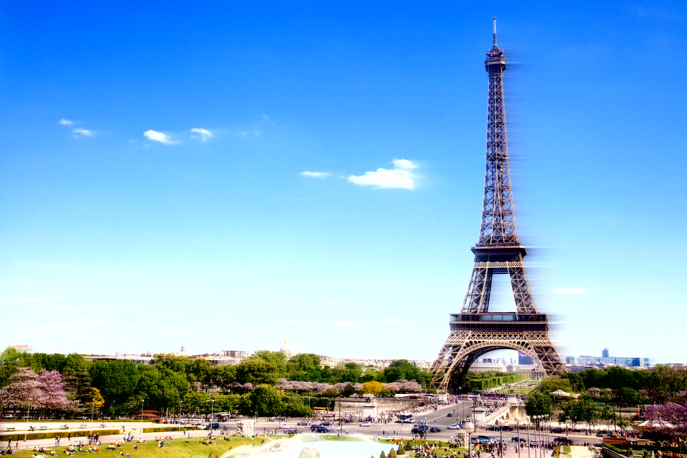
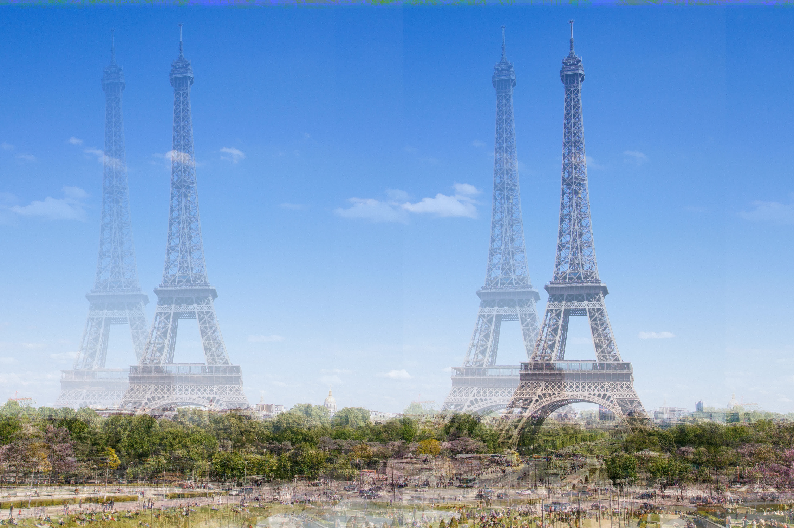
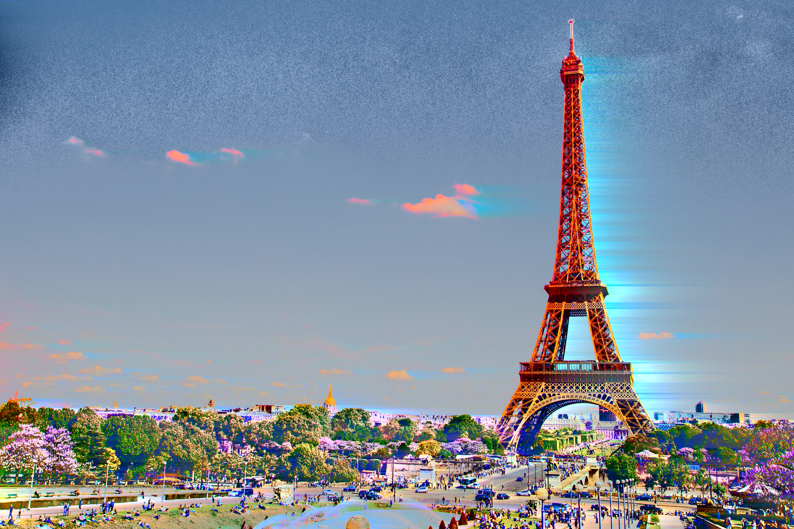
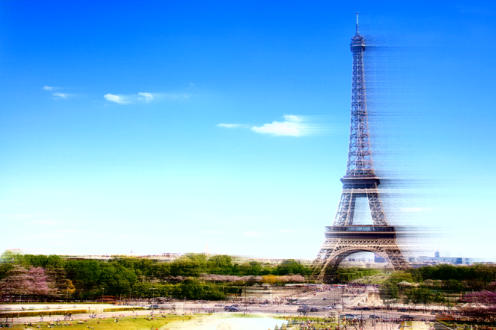
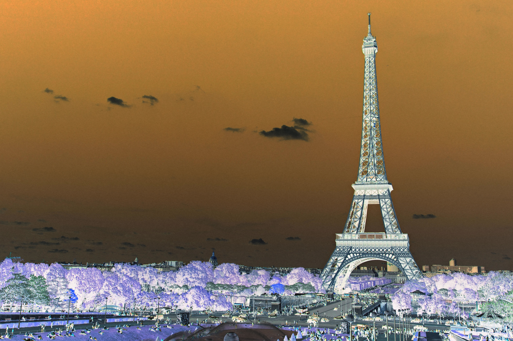

Title: Audio editing images
Date: 2017-04-09 21:35
Category: art
Tags: audio, art, images, data, bending, databending
Description: There's nothing preventing images from being edited as audio data, however there are a few pitfalls. Which is why I wrote Audio Shop.

[Audio Shop](https://github.com/robertfoss/audio_shop/) is a simple script
that I cobbled together that gets you started with mangling image data as
if it was audio data.

The script wraps 3 individually excellent tools; [ffmpeg](https://ffmpeg.org/),
[ImageMagick](https://www.imagemagick.org/script/index.php) and
[SoX](http://sox.sourceforge.net/).

The way it works is by first converting an image to a raw format like rgb
or yuv. This is done to prevent the audio editor from destroying the structure
of (relatively) complex formats like jpg, png or gif.

If converting to a raw format is the first step, the second step is
importing the raw image data into the audio editor. To do this
in way you can expect good results from, the raw format should use
a bit-depth that your image editor can use. For example RGB, where
each color channel is 8 bits. And the audio editor imports the raw
data as 8-bit unsigned data.

Additionally when using a format like RGB the Red/Green/Blue color
bits of the channels are located next to eachother like
<small>RRRRRRRGGGGGGGGBBBBBBBB</small> which causes issues when
doing things like echoes and the echo of of the Red 8-bit field
bleeds into the Green or Blue field.

The solution to this is using a planar format where the RGB or YUV
channels are not interleaved in the <small>RGBRGBRGBRGB</small>
fashion but rather <small>RRRRGGGGBBBB</small>. A format like that
is YUV444P.

I hope you find this tool somewhat useful and/or fun!

